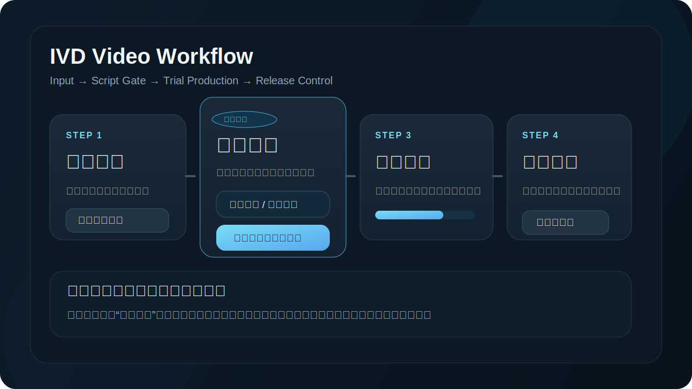
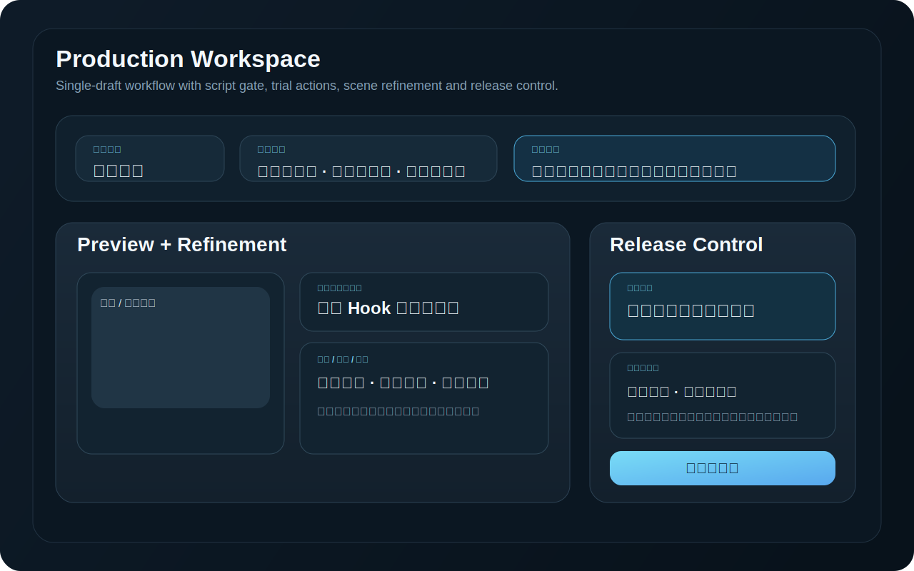

# IVD Video Workflow

一个面向 `IVD` 行业内容生产的本地视频工厂。

它把“输入主题 -> 预制脚本 -> 试产打磨 -> 导出成片”串成一条可反复修订的工作流，适合快速生成、回看、修改和导出竖屏短视频草稿。

## 项目预览





## 现在能做什么

- 输入 `主题` 或 `标题 / 正文`，生成视频草稿
- 先进入 `预制脚本` 阶段，确认口播结构和预计节奏
- 进入 `试产打磨` 阶段，查看封面、标题、口播、字幕和分镜
- 在页面里直接修改：
  - 标题
  - 封面文案
  - Hook / 正文 / CTA
  - 分镜标题 / 类型 / 时长 / 口播
- 按成本分级执行动作：
  - `轻量试产`
  - `局部重建`
  - `完整试产`
- 执行导出前检查并生成最终视频
- 保留草稿历史，支持重新打开继续生产

## 当前产品逻辑

项目现在按三阶段来组织：

1. `输入设定`
   - 定主题、角度、风格、时长和封面风格
2. `预制脚本`
   - 先确认“讲什么、怎么讲、讲多久”
3. `试产打磨`
   - 再处理口播、字幕、分镜、检查和导出

这样可以把最贵的动作后置，减少无谓的配音、制图和整条重跑。

## 本地启动

```bash
npm install
npm start
```

启动后访问：

```text
http://127.0.0.1:3016
```

## 冒烟检查

仓库内置了一个本地回归脚本：

```bash
npm run smoke -- --draft=<draft-id>
```

常见用法：

```bash
npm run smoke -- --draft=<draft-id> --combo=a-report --scene=scene-2
npm run smoke -- --draft=<draft-id> --export
```

## 配置方式

项目把模型调用拆成了 5 个独立调用点：

- `script`：文案生成
- `storyboard`：分镜生成
- `image`：封面生成
- `tts`：配音生成
- `moderation`：审核 / 医疗合规预检

配置来源有两类：

1. `.env.local`
   - 用于默认值和兼容旧配置
   - 参考：[.env.local.example](./.env.local.example)

2. `data/config/llm-config.json`
   - 用于各调用点独立配置
   - 仓库中已提供模板：
     - [data/config/llm-config.example.json](./data/config/llm-config.example.json)
     - [data/config/llm-config.proxy-template.json](./data/config/llm-config.proxy-template.json)

注意：

- `data/config/llm-config.json` 已被 `.gitignore` 忽略，不会提交到仓库
- 页面内也带有管理端配置面板，可直接维护这 5 个调用点

## 环境要求

- Node.js
- `ffmpeg`
  - 用于最终视频导出
  - 如果本机没有 `ffmpeg`，工具仍可生成导出脚本，但不能直接出片

## 目录结构

```text
public/        前端页面与交互逻辑
src/           本地服务
scripts/       启停与冒烟脚本
data/config/   配置模板
data/drafts/   本地草稿与产物（已忽略，不提交）
data/logs/     本地日志（已忽略，不提交）
```

## 当前仓库策略

为了方便长期迭代，仓库默认不提交这些本地运行产物：

- `node_modules/`
- `data/drafts/`
- `data/logs/`
- `data/config/llm-config.json`
- `.env.local`

## 后续方向

这个项目目前已经把核心生产工厂框架搭起来了，后续最值得继续强化的通常是：

- 分镜精修工作台
- 试产动作分级和脏区联动
- 导出前发布判断
- GitHub 展示和部署说明
